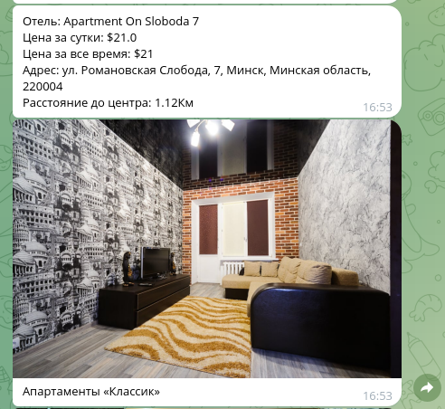

# search_hotel_bot
Telegram bot for searching hotels around the world

***

### Внешний вид.

*** 

### Установка.

1. Создать виртуальное окружение.

   `python -m venv venv`

   `source venv/bin/activate`

2. Установить зависимости.

   `pip install -r requirements.txt`

3. Выполнить миграции, для создания базы.

   `alembic revision --autogenerate -m "create_table"`

   `alembic upgrade head`

4. Создать переменные окружения.

   Необходимо создать файл .env
   TOKEN=Ваш токен от телеграм бота
   RAPIDAPI_KEY=Ваш rapidapi key

5. Непосредственно запуск приложения.

   `python3 main.py`

***

Приложение готово к использованию.